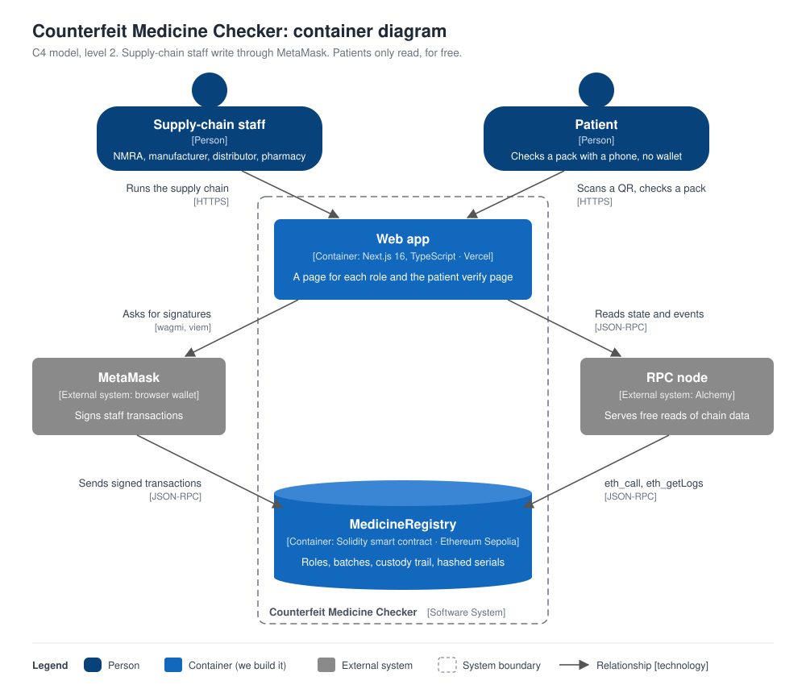

# Counterfeit Medicine Checker

[](https://github.com/Raviyaa27/counterfeit-medicine-checker/actions/workflows/ci.yml)

EC8204 Blockchain and Cyber Security group project, University of Ruhuna.

Patients scan the QR code on a medicine pack to check on the Ethereum blockchain whether it is
genuine, already sold (a copied code), recalled, expired, or not registered at all.

## Team: start here

Read the [implementation guide (PDF)](docs/Counterfeit_Medicine_Checker_Implementation_Guide.pdf).
It covers the design, how the work is split between three members, the day-by-day plan, setup
commands, and the tested contract, tests and frontend code.

Track progress with the [implementation plan](docs/IMPLEMENTATION_PLAN.md), which lists the phases
and tasks.

## Status

| Part | State |
|---|---|
| Smart contract (`contracts/`) | Done: 32 tests, 100% coverage, no medium or high Slither findings. See the [security report](docs/security-report.md) |
| Web app (`frontend/`) | Done on the local chain: verify, manufacturer, pharmacy, admin (NMRA), supply and landing pages |
| Sepolia and Vercel deployment | Not done yet (Phase 7) |

The contract address, Etherscan link and live site will be added here after deployment.

## How it works



A batch moves from the manufacturer, through NMRA approval and the distributor, to the pharmacy,
which sells each pack. The patient scans the pack's QR code to check it on `/verify`.

Only the `keccak256` **hash** of each pack's secret serial goes on-chain, so nobody can read the
serial list from the blockchain. A pack can be sold only once, so a photocopied QR code shows
ALREADY SOLD. The patient's `/verify` page is a free read and needs no wallet.

| Page | Who uses it | What it does |
|---|---|---|
| `/verify?s=0x...` | Patients | Shows GENUINE, ALREADY SOLD, NOT FOUND, RECALLED, EXPIRED or NOT APPROVED, plus the custody trail |
| `/manufacturer` | Manufacturer | Registers a batch, then prints QR codes or downloads the serial CSV |
| `/supply` | Manufacturer, distributor | Ships a batch to the next party and shows the custody trail |
| `/pharmacy` | Pharmacy | Marks a pack as sold |
| `/admin` | NMRA (regulator) | Registers participants, approves batches, recalls batches |

## Prerequisites

Do this once on **your own laptop**. Everything is free. The commands below assume Windows 11; on
macOS or Linux, install Foundry directly (step 4) and skip the WSL parts.

| # | Tool | Needed by | Check it with |
|---|---|---|---|
| 1 | Git | Everyone | `git --version` |
| 2 | Node.js 22 LTS | Everyone | `node --version` |
| 3 | MetaMask (browser extension) | Everyone | Fox icon in the browser |
| 4 | Foundry (`forge`, `cast`, `anvil`) | Everyone, to run the local chain | `forge --version` (in WSL on Windows) |
| 5 | Slither | Contract work only | `slither --version` |
| 6 | VS Code with the Solidity extension (Nomic Foundation) | Optional | |

### 1 and 2. Git and Node.js

Install [Git for Windows](https://git-scm.com/download/win) and [Node.js 22 LTS](https://nodejs.org),
then run this once so long paths don't break checkouts:

```bash
git config --global core.longpaths true
```

Use **Git Bash** for the commands in this README. (WSL is used only for Foundry.)

### 3. MetaMask

Install it from [metamask.io/download](https://metamask.io/download) and create a **new wallet used
only for this project**. Never use a wallet that holds real money. Later you'll add a local test
network and import test accounts, see [MetaMask setup](#metamask-setup).

### 4. Foundry

**Windows: install it inside WSL.** Windows "Smart App Control" blocks Foundry's unsigned Windows
binaries with the message "An Application Control policy has blocked this file", so run Foundry
in Ubuntu on WSL instead. Anvil running in WSL is reachable from Windows at
`http://127.0.0.1:8545`, so MetaMask and the web app stay on Windows.

1. Find your Ubuntu name, then open it. If you have no Ubuntu, run `wsl --install -d Ubuntu-24.04`
   in PowerShell and restart.

   ```bash
   wsl -l -v                    # note the exact name, e.g. Ubuntu-24.04
   wsl -d Ubuntu-24.04
   ```

2. Inside Ubuntu, install Foundry:

   ```bash
   curl -L https://foundry.paradigm.xyz | bash
   export PATH="$PATH:$HOME/.foundry/bin"
   echo 'export PATH="$PATH:$HOME/.foundry/bin"' >> ~/.bashrc
   foundryup
   forge --version              # v1.8.3 or newer
   ```

3. Node inside WSL (only needed to build and test the contracts there). Use nvm, which needs no
   `sudo`:

   ```bash
   curl -fsSo- https://raw.githubusercontent.com/nvm-sh/nvm/v0.40.3/install.sh | bash
   source ~/.nvm/nvm.sh
   nvm install 22
   node --version
   ```

Your project folder is visible inside WSL under `/mnt/d/...` (use your drive letter and path).

**macOS or Linux:** run `curl -L https://foundry.paradigm.xyz | bash`, then `foundryup`.

### 5. Slither (contract work only)

```bash
python -m pip install slither-analyzer
slither --version
```

## Get the code and install dependencies

```bash
git clone --recurse-submodules https://github.com/Raviyaa27/counterfeit-medicine-checker.git
cd counterfeit-medicine-checker
```

If you cloned without `--recurse-submodules`, run `git submodule update --init` (this fetches
`forge-std`).

**Contracts.** Run this inside WSL so the packages match your Foundry:

```bash
cd contracts
npm ci                          # installs OpenZeppelin 5.6.1
forge build
```

**Web app.** Run this in Git Bash on Windows:

```bash
cd frontend
npm ci
cp .env.example .env.local      # points the app at the local Anvil chain
```

## Run everything locally

You need three things running. Start them in this order.

**Terminal 1 (WSL): the local blockchain.**

```bash
anvil --host 0.0.0.0
```

Leave it running. It prints 10 test accounts and their private keys.

**Terminal 2 (WSL): deploy the contract and create demo data.**

```bash
cd contracts
bash script/local-demo.sh
```

It prints the registry address plus three verify links: Genuine, Sold and Fake. The script assumes
a **fresh** Anvil, because it hard-codes the first deployment address
(`0x5FbDB2315678afecb367f032d93F642f64180aa3`) and re-registering the same serials fails. **Restart
Anvil (Ctrl+C, run it again) before every run.**

**Terminal 3 (Git Bash): the web app.**

```bash
cd frontend
npm run dev
```

Open <http://localhost:3000>. Try the links the script printed:

| Link | Expected |
|---|---|
| `/verify?s=0x8f3a1c2b4d5e6f708192a3b4c5d6e7f8` | Green **GENUINE** |
| `/verify?s=0x11112222333344445555666677778888` | Amber **ALREADY SOLD** (sold by Pharmacy A, Galle) |
| `/verify?s=0xdeadbeefdeadbeefdeadbeefdeadbeef` | Red **NOT FOUND** |

## MetaMask setup

You need this only for the pages that send transactions (`/manufacturer`, `/supply`, `/pharmacy`
and `/admin`). The verify page needs no wallet.

**1. Add the Anvil network.** Open MetaMask, click the network dropdown (top-left), then
**Add a custom network** and enter:

| Field | Value |
|---|---|
| Network name | `Anvil` |
| RPC URL | `http://127.0.0.1:8545` |
| Chain ID | `31337` |
| Currency symbol | `ETH` |

MetaMask warns that the name or symbol "may not match" chain ID 31337 (another network is
registered under that ID) and suggests GoChain and GO. **Ignore the warnings** and click **Save**.

**2. Import the four test accounts.** In newer MetaMask versions: open the accounts list, click
**Add wallet**, then **Import an account**, choose **Private Key**, paste a key and click
**Import**. (The **Add account** button is not the same thing. It creates a new account from your own
recovery phrase.) Then rename each account with its three-dot menu, then **Rename**.

| Name | Address | Private key |
|---|---|---|
| NMRA (regulator) | `0xf39F…2266` | `0xac0974bec39a17e36ba4a6b4d238ff944bacb478cbed5efcae784d7bf4f2ff80` |
| Manufacturer | `0x7099…79C8` | `0x59c6995e998f97a5a0044966f0945389dc9e86dae88c7a8412f4603b6b78690d` |
| Distributor | `0x3C44…93BC` | `0x5de4111afa1a4b94908f83103eb1f1706367c2e68ca870fc3fb9a804cdab365a` |
| Pharmacy | `0x90F7…b906` | `0x7c852118294e51e653712a81e05800f419141751be58f605c371e15141b007a6` |

> These are Anvil's **public** test keys, printed by every Anvil and used in `local-demo.sh`. Use
> them **only on the local chain**. Never put real funds in them, and never use them on Sepolia or
> mainnet.

**3. Use the app.** On a wallet page, select the right account in MetaMask, click **Connect
MetaMask**, then click **Switch to Anvil (local)** and approve the prompt. Recent MetaMask versions
pick the network per site, so the app asks for the switch itself.

| To do this | Use this account |
|---|---|
| Register participants, approve, recall (`/admin`) | NMRA |
| Register a batch (`/manufacturer`), ship it (`/supply`) | Manufacturer |
| Ship on to a pharmacy (`/supply`) | Distributor |
| Sell a pack (`/pharmacy`) | Pharmacy |

**4. After restarting Anvil,** MetaMask can report "nonce too high". Fix it under Settings, then
Advanced, then **Clear activity and nonce data** (older versions call it "Clear activity tab
data"). If you can't find it, search Settings for "nonce". This clears only local history for that
account.

## Try the full flow (about 5 minutes)

Start from a fresh Anvil **without** running `local-demo.sh`, but deploy the contract first:

```bash
cd contracts
NMRA=0xac0974bec39a17e36ba4a6b4d238ff944bacb478cbed5efcae784d7bf4f2ff80
REGULATOR_ADDRESS=$(cast wallet address $NMRA) forge script script/Deploy.s.sol \
  --rpc-url http://127.0.0.1:8545 --private-key $NMRA --broadcast
```

Then in the browser:

1. **NMRA, `/admin`:** register the Manufacturer, Distributor and Pharmacy addresses with names and roles.
2. **Manufacturer, `/manufacturer`:** create a batch. Print or download the QR codes. The batch is Pending.
3. **Anyone, `/verify`:** open one pack's link. It shows NOT APPROVED.
4. **NMRA, `/admin`:** click **Approve** on the batch.
5. **Manufacturer, `/supply`:** ship the batch to the distributor. **Distributor, `/supply`:** ship it to the pharmacy. The trail shows both steps.
6. **Anyone, `/verify`:** the pack now shows GENUINE.
7. **Pharmacy, `/pharmacy`:** paste the pack's link and click **Mark as sold**.
8. **Anyone, `/verify`:** the same pack now shows ALREADY SOLD. Try selling it again for the clone alert.
9. **NMRA, `/admin`:** recall a batch. Its packs show RECALLED.

## Tests and security checks

Run these inside WSL, from `contracts/`:

```bash
forge test                                                           # 32 passed
forge test --match-test Attack -vv                                   # the 9 attack tests
forge coverage --report summary --no-match-coverage "(test|script)"  # 100%
forge test --gas-report
forge fmt --check                                                    # formatting, also run in CI
slither .                                                            # 4 low findings, all timestamp
```

For the web app, from `frontend/`:

```bash
npm run lint
npx tsc --noEmit
npm run build
```

## Project layout

```
contracts/   Foundry project: src/MedicineRegistry.sol, script/ (deploy + local demo), test/
frontend/    Next.js app: app/ (pages), components/, hooks/, lib/ (config, roles, tx helper, ABI)
docs/        Guide, implementation plan, security report and evidence
.github/     CI: format check, build, tests and Slither on every push
```

If you change the contract, re-export the ABI for the app (run in WSL from `contracts/`):

```bash
echo "export const registryAbi = $(forge inspect MedicineRegistry abi --json) as const;" > ../frontend/lib/registryAbi.ts
```

## Troubleshooting

| Problem | Fix |
|---|---|
| `forge: command not found` | You're outside WSL, or the PATH line is missing. Open Ubuntu (`wsl -d Ubuntu-24.04`) and run `export PATH="$PATH:$HOME/.foundry/bin"`. |
| "Application Control policy has blocked this file" | Smart App Control blocks Foundry on Windows. Use WSL (see Foundry above). |
| `wsl -d Ubuntu` says no such distribution | Use the exact name from `wsl -l -v`, such as `Ubuntu-24.04`. |
| `sudo` hangs in WSL | It is waiting for a password. Use the nvm route above, which needs no `sudo`. |
| `forge build` says it can't find `@openzeppelin` | Run `npm ci` in `contracts/` (inside WSL). |
| `forge-std` is missing or empty | Run `git submodule update --init`. |
| Verify page says "Could not reach the network" | Anvil isn't running, or the address in `frontend/.env.local` doesn't match. Restart Anvil, run `local-demo.sh`, then reload. |
| `local-demo.sh` fails with "already exists" | The chain isn't fresh. Restart Anvil and run it again. |
| MetaMask "nonce too high" | Clear activity and nonce data (see MetaMask setup, step 4). |
| MetaMask won't let me click the Anvil network | Recent versions don't switch the wallet from the list. Use **Switch to Anvil (local)** on an app page. |
| A button seems to do nothing | MetaMask may be waiting for you. Check for its popup, which can hide behind the browser window. |
| Anvil not reachable from Windows | Start it with `anvil --host 0.0.0.0` and use `http://127.0.0.1:8545`. |
| Phone can't load the local site | The phone can't reach your laptop's Anvil. Real phone testing needs the Sepolia deployment (Phase 7). |

## Team rules

- `main` must always work. Work on your own branch (`m1-contracts`, `m2-frontend`, `m3-deploy`) and
  merge through a Pull Request.
- **Never commit** `.env` files, private keys, recovery phrases, or serial CSVs. The `.gitignore`
  already covers `.env*` and `*.csv`.
- Anvil's built-in keys are public and only for the local chain. For Sepolia, deploy from an
  encrypted keystore (`cast wallet import`), never a key in `.env`.
- Run commands in Git Bash (Windows) and Foundry commands in WSL.
